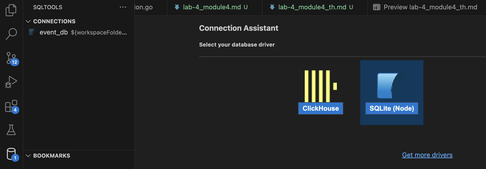
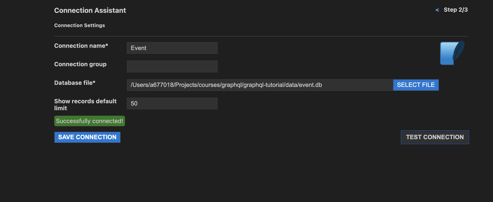
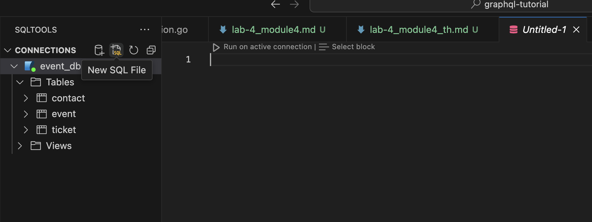
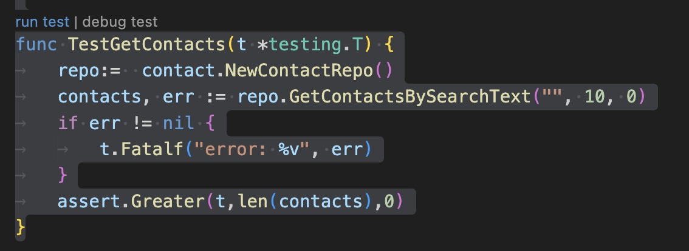
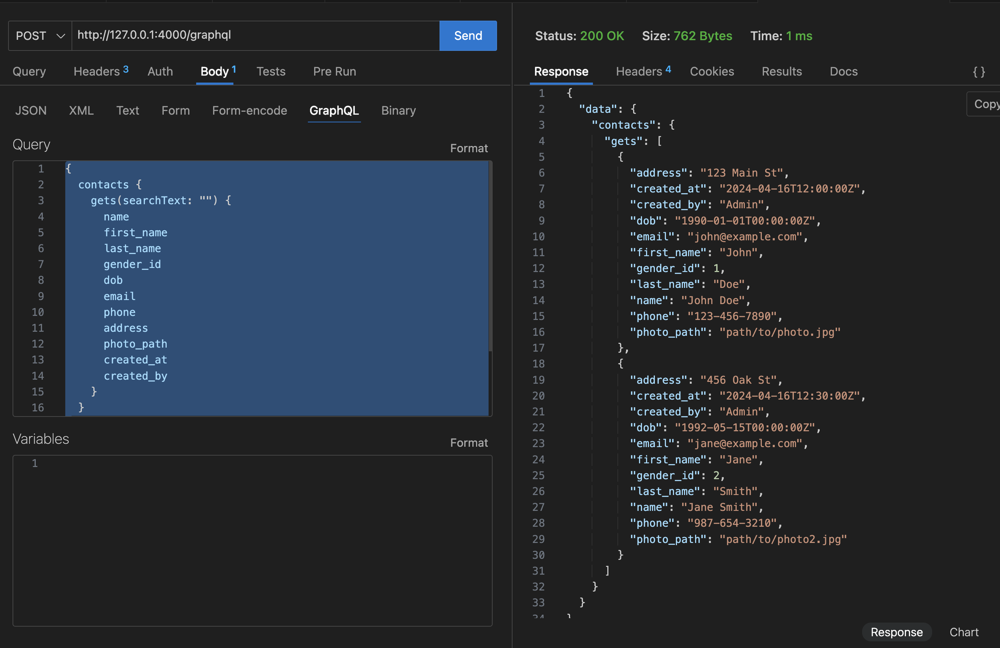
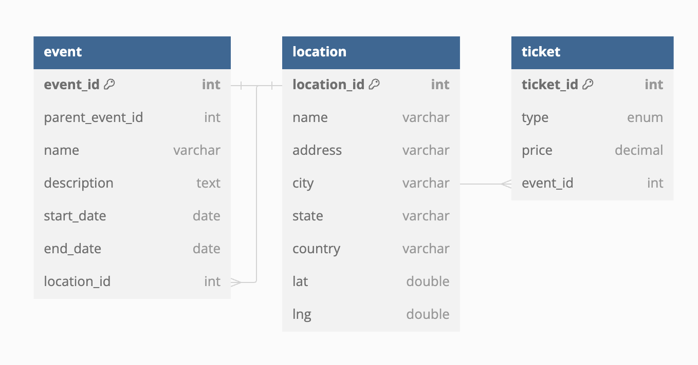

# Module 4: Query
## Lab4.1 - Query Contact 
**Objective:** Understand creating functions to query data from Contact tables with GraphQL.
**Related files in this lab**
```plantuml

@startmindmap
* data
** event.db
* src
** graphql-api
*** cmd
**** server
***** .env
***** main.go
*** config
**** config.go
*** internal
**** base.repo.go
**** contact
***** contact.repo.go
***** contactcomplex.repo.go
*** pkg
**** data
***** db.go
***** models
****** contact.model.go
****** filter.model.go
**** graphql
***** resolvers
****** contact.resolver.go
***** agruments.go
***** schema.go
***** types.go
** test
*** .env
*** contact.repo_test.go
* sql
** lab-4.sql
@endmindmap

```

### Prepare database and data samples of Contact.
1. Install SQLTools for VSCode


*Figure 4.1-1 SQLTools extension in VSCode.*

2. Create a database named "event.db" and place it in Folder "data".
```sh
/graphql-tutorial/data/event.db
```
3. Install SQLite (Node)

*Figure 4.1-2 SQLite Node extension.*

4. Test database connection

*Figure 4.1-3 Test database connection.*

5. Create the Contact table by clicking the new sql button and entering the command.

*Figure 4.1-4 Close the sql file to create the contact table.*

**Command to create contact table**
```sql
CREATE TABLE IF NOT EXISTS contact (
  contact_id INTEGER PRIMARY KEY,
  name TEXT,
  first_name TEXT,
  last_name TEXT,
  gender_id INTEGER,
  dob DATE,
  email TEXT,
  phone TEXT,
  address TEXT,
  photo_path TEXT,
  created_at DATETIME,
  created_by TEXT
);
```
6.Create a snippet
```sql
INSERT INTO contact (contact_id, name, first_name, last_name, gender_id, dob, email, phone, address, photo_path, created_at, created_by)
VALUES 
(1, 'John Doe', 'John', 'Doe', 1, '1990-01-01', 'john@example.com', '123-456-7890', '123 Main St', 'path/to/photo.jpg', '2024-04-16 12:00:00', 'Admin'),
(2, 'Jane Smith', 'Jane', 'Smith', 2, '1992-05-15', 'jane@example.com', '987-654-3210', '456 Oak St', 'path/to/photo2.jpg', '2024-04-16 12:30:00', 'Admin');

```

### Prepare Configuration To connect to a database in Golang.
2. Create a config.go file in the config folder.
```sh
config/config.go
```
3. Type the code in config.go
```go
package config

import (
    "fmt"
    "os"
    "strconv"
    "sync"

    "github.com/joho/godotenv"
)

// Config represents application configuration
type Config struct {
    DBHost     string
    DBPort     int
    DBUser     string
    DBPassword string
	DBName string
    SecretKey string
    TokenAge int
}

var instance *Config
var once sync.Once

// LoadConfig loads the configuration from environment variables
func NewConfig() *Config {
    once.Do(func() {
        // Load environment variables from .env file
        if err := godotenv.Load(); err != nil {
            fmt.Println("Failed to load env variables:", err)
            return
        }

        // Parse environment variables and create config object
        instance = &Config{
            DBHost:     os.Getenv("DB_HOST"),
            DBUser:     os.Getenv("DB_USER"),
            DBPassword: os.Getenv("DB_PASSWORD"),
			DBName: os.Getenv("DB_NAME"),
            SecretKey: os.Getenv("SECRET_KEY"),
        }

        // Parse DB port as integer
        dbPortStr := os.Getenv("DB_PORT")
        if dbPortStr != "" {
            dbPort, err := strconv.Atoi(dbPortStr)
            if err != nil {
                fmt.Println("Invalid DB_PORT value:", err)
                return
            }
            instance.DBPort = dbPort
        }
        tokenAge, err :=strconv.Atoi(os.Getenv("TOKEN_AGE"))
        if (err != nil) {
            fmt.Println("Invalid TOKEN_AGE value:", err)
            return
        }
        instance.TokenAge = tokenAge
    })
    return instance
}

// GetConfig returns the singleton configuration instance
func GetConfig() *Config {
    return instance
}

```

4. Open Command Line Terminal and install the library for reading .env files.
```sh
 go get github.com/joho/godotenv
```

5. Create an .env file in the folder /cmd/server/.env and put the config in the file as follows.
```sh
DB_HOST=
DB_PORT=
DB_USER=
DB_PASSWORD=
DB_NAME=<dbpath>
SECRET_KEY=your-secret-key
TOKEN_AGE=60
```

ุ6. Create a Database object for the Sqlite Create,Update, Delete,Select management service at pkg/data/db.go.
then enter the code.
```go
package data

import (
    "database/sql"

    "fmt"
	"log"
	"sync"
    _ "github.com/mattn/go-sqlite3"
	"graphql-api/config"
)

// DB represents the SQLite database
type DB struct {
    Connection *sql.DB
}

var instance *DB
var once sync.Once


// NewDB initializes a new instance of the DB struct
func NewDB() (*DB) {
	once.Do (func() {
		config := config.NewConfig()
		conn, err := sql.Open("sqlite3", config.DBName)
		if err != nil {
			log.Fatal(err)
		}
		instance = &DB{conn}
	})
    return instance
}

func (db *DB) Open() error {
    if db.Connection == nil {
        config := config.NewConfig()
		conn, err := sql.Open("sqlite3", config.DBName)
		if err != nil {
			return err
		}
		instance = &DB{conn}
    }
    return nil
}

// Close closes the database connection
func (db *DB) Close() error {
    if db.Connection == nil {
        return nil
    }
    return db.Connection.Close()
}

// Insert inserts data into the specified table
func (db *DB) Insert(query string, args ...interface{}) (sql.Result, error) {
    stmt, err := db.Connection.Prepare(query)
    if err != nil {
        return nil, fmt.Errorf("failed to prepare statement: %v", err)
    }
    defer stmt.Close()

    result, err := stmt.Exec(args...)
    if err != nil {
        return nil, fmt.Errorf("failed to execute statement: %v", err)
    }

    return result, nil
}

// Query executes a query and returns rows
func (db *DB) Query(query string, args ...interface{}) (*sql.Rows, error) {
    rows, err := db.Connection.Query(query, args...)
    if err != nil {
        return nil, fmt.Errorf("failed to execute query: %v", err)
    }

    return rows, nil
}

// QueryRow executes a query that is expected to return at most one row
func (db *DB) QueryRow(query string, args ...interface{}) (*sql.Row, error) {
    row := db.Connection.QueryRow(query, args...)
    return row, nil
}

// Delete executes a delete statement
func (db *DB) Delete(query string, args ...interface{}) (sql.Result, error) {
    stmt, err := db.Connection.Prepare(query)
    if err != nil {
        return nil, fmt.Errorf("failed to prepare statement: %v", err)
    }
    defer stmt.Close()

    result, err := stmt.Exec(args...)
    if err != nil {
        return nil, fmt.Errorf("failed to execute statement: %v", err)
    }

    return result, nil
}

// Update executes an update statement
func (db *DB) Update(query string, args ...interface{}) (sql.Result, error) {
    stmt, err := db.Connection.Prepare(query)
    if err != nil {
        return nil, fmt.Errorf("failed to prepare statement: %v", err)
    }
    defer stmt.Close()

    result, err := stmt.Exec(args...)
    if err != nil {
        return nil, fmt.Errorf("failed to execute statement: %v", err)
    }

    return result, nil
}


```
6. Download Sqlite library for golang github.com/mattn/go-sqlite3 Open Command Line Terminal.
```sh
go get github.com/mattn/go-sqlite3
```

7. Create a contact model with a database-like structure at pkg/data/models/contact.model.go. Enter the code as follows.
```go
package models

import (
	"time"
)

// Contact represents a Contact record in the database
type ContactModel struct {
	ContactId int64 `json:"contact_id"`
	Name string `json:"name"`
	FirstName string `json:"first_name"`
	LastName string `json:"last_name"`
	GenderId int64 `json:"gender_id"`
	Dob time.Time `json:"dob"`
	Email string `json:"email"`
	Phone string `json:"phone"`
	Address string `json:"address"`
	PhotoPath string `json:"photo_path"`
	CreatedAt time.Time `json:"created_at"`
	CreatedBy string `json:"created_by"`
}
```

8. Create *contact.repo.go* To connect to the contact table at *internal/contact/contact.repo.go*, enter the code as follows.
```go
package contact

import (
	"fmt"
	"graphql-api/pkg/data"
	"graphql-api/pkg/data/models"
	_ "github.com/mattn/go-sqlite3"
)

// ContactRepo represents the repository for contact operations
type ContactRepo struct {
	DB *data.DB
}

// NewContactRepo creates a new instance of ContactRepo
func NewContactRepo() *ContactRepo {
	db := data.NewDB()
	return &ContactRepo{DB: db}
}

// Get Contacts fetches contacts from the database with support for text search, limit, and offset
func (cr *ContactRepo) GetContactsBySearchText(searchText string, limit, offset int) ([]*models.ContactModel, error) {
	var contacts []*models.ContactModel

	query := fmt.Sprintf(`
            SELECT * FROM contact
             Where name like '%%%s%%' OR first_name like '%%%s%%' OR last_name like '%%%s%%' OR email like '%%%s%%' OR phone like '%%%s%%' OR address like '%%%s%%' OR photo_path like '%%%s%%'
            LIMIT ? OFFSET ?
        `, searchText, searchText, searchText, searchText, searchText, searchText, searchText)

	rows, err := cr.DB.Query(query, limit, offset)
	if err != nil {
		return nil, err
	}
	defer rows.Close()

	for rows.Next() {
		var contact models.ContactModel
		err := rows.Scan(
			&contact.ContactId,
			&contact.Name,
			&contact.FirstName,
			&contact.LastName,
			&contact.GenderId,
			&contact.Dob,
			&contact.Email,
			&contact.Phone,
			&contact.Address,
			&contact.PhotoPath,
			&contact.CreatedAt,
			&contact.CreatedBy,
		)
		if err != nil {
			return nil, err
		}
		contacts = append(contacts, &contact)
	}

	if err := rows.Err(); err != nil {
		return nil, err
	}

	return contacts, nil
}

```

9. Write a test to test the functionality of *contact.repo* by creating a file *contact.repo_test.go* at /test and enter the code as follows.
```go
package test

import (
	"graphql-api/internal/contact"
	"testing"

	"github.com/stretchr/testify/assert"
)

func TestGetContacts(t *testing.T) {
	repo:=  contact.NewContactRepo()
	contacts, err := repo.GetContactsBySearchText("", 10, 0)
	if err != nil {
		t.Fatalf("error: %v", err)
	}
	assert.Greater(t,len(contacts),0)
}
```
10. Copy the .env file to the test folder at the contact.repo_test.go file. Click *run test*

*Figure 4.1-5 Test contact repository, can connect to database*

### Prepare code to support GraphQL Query.

Schema

- Queries

    - ContactQuery
    
        - Type
            
            - Fields
        
        - Agruments
            
            - (searchText, limit, offset)
        
        - Resolve
            
            - ContactRepo.GetContactsByTextSearch(Agruments)

1. Prepare a ContactGraphQL Type to use as a data structure. When we query the data, we will get structured information with what fields? By adding code in *pkg/graphql/types.go* as follows:

```go
package graphql

import (
	"github.com/graphql-go/graphql"
	"graphql-api/pkg/data/models"
	"graphql-api/pkg/graphql/resolvers"
)

/*
Contact Types
*/
var ContactGraphQLType = graphql.NewObject(graphql.ObjectConfig{
	Name: "Contact",
	Fields: graphql.Fields{
		"contact_id": &graphql.Field{Type: graphql.Int},
		"name":       &graphql.Field{Type: graphql.String},
		"first_name": &graphql.Field{Type: graphql.String},
		"last_name":  &graphql.Field{Type: graphql.String},
		"gender_id":  &graphql.Field{Type: graphql.Int},
		"dob":        &graphql.Field{Type: graphql.DateTime},
		"email":      &graphql.Field{Type: graphql.String},
		"phone":      &graphql.Field{Type: graphql.String},
		"address":    &graphql.Field{Type: graphql.String},
		"photo_path": &graphql.Field{Type: graphql.String},
		"created_at": &graphql.Field{Type: graphql.DateTime},
		"created_by": &graphql.Field{Type: graphql.String},
		// Add field here
	},
})
```

2. Prepare the function GetContactsResolve for graphql to call when querying data from Contacts from GraphQL. Enter the code in the file. *pkg/graphql/resolvers/contact.resolver.go*

```go
package resolvers

import (
	"graphql-api/internal/contact"
	"github.com/graphql-go/graphql"
	"graphql-api/pkg/data/models"

)

func GetContactResolve(params graphql.ResolveParams) (interface{}, error) {
	// Update limit and offset if provided
	limit, ok := params.Args["limit"].(int)
	if !ok {
		limit = 10
	}

	offset, ok := params.Args["offset"].(int)
	if !ok {
		offset = 0
	}

	searchText, ok := params.Args["searchText"].(string)
	if !ok {
		searchText = ""
	}
	contactRepo := contact.NewContactComplexRepo()

	// Fetch contacts from the database
	contacts, err := contactRepo.GetContactsBySearchText(searchText, limit, offset)
	if err != nil {
		return nil, err
	}
	return contacts, nil
}
```

3. Prepare the agrument value as input to the function. GetContactResolve In the *pkg/graphql/agruments.go* file, enter the code:
```go
package graphql

import (
	"github.com/graphql-go/graphql"
)

var SearhTextQueryArgument = graphql.FieldConfigArgument{
	"searchText": &graphql.ArgumentConfig{
		Type: graphql.String,
	},
	"limit": &graphql.ArgumentConfig{
		Type: graphql.Int,
	},
	"offset": &graphql.ArgumentConfig{
		Type: graphql.Int,
	},
}
```

4. Go back to the types.go file and add the code below. ContactQueriesType to map the resulting Type, Agruments, and Resolve.
```go
type ContactQueries struct {
	Gets func(string) ([]*models.ContactModel, error) `json:"gets"`
}

// Define the ContactQueries type
var ContactQueriesType = graphql.NewObject(graphql.ObjectConfig{
	Name: "ContactQueries",
	Fields: graphql.Fields{
		"gets": &graphql.Field{
			Type:    graphql.NewList(ContactGraphQLType),
			Args:    SearhTextQueryArgument,
			Resolve: resolvers.GetContactResolve,
		},
	},
})

```
From steps 1-4, we have successfully created a ContactQuery for GraphQL. but still cannot be used Must be registered with RootQuery.

5. Remove ContactQueriesType Go register it in RootQuery by entering the code inside the file. */pkg/graphql/schema.go* as follows
```go

package graphql

import (
	"github.com/graphql-go/graphql"
)

// RootQuery represents the root GraphQL query.
var RootQuery = graphql.NewObject(
	graphql.ObjectConfig{
		Name: "RootQuery",
		Fields: graphql.Fields{
			"contacts": &graphql.Field{
				Type: ContactQueriesType,
				Resolve: func(p graphql.ResolveParams) (interface{}, error) {
					return &ContactQueries{}, nil
				},
			},
			// Add other queries as needed
		},
	},
)

```

6. Bring RootQuery to setup in *cmd/server/main.go* as follows.
```go
package main

import (
	"fmt"
	"net/http"

	"github.com/graphql-go/graphql"
	"github.com/graphql-go/handler"
	"graphql-api/config"
	gql "graphql-api/pkg/graphql"
)


func main() {

	// Load configuration
	config := config.NewConfig()
	
	rootQuery := gql.RootQuery // Assuming you have a root query defined in schema.go
	schema, err := graphql.NewSchema(graphql.SchemaConfig{
		Query: rootQuery,
	})
	if err != nil {
		panic(err)
	}
	// Create a GraphQL handler for HTTP requests
	graphqlHandler := handler.New(&handler.Config{
		Schema:     &schema,
		Pretty:     true,
		GraphiQL:   false, // Disable GraphiQL for subscriptions endpoint
		Playground: true,
	})

	// Serve GraphQL API at /graphql endpoint
	http.Handle("/graphql", graphqlHandler)

	// Start the HTTP server
	fmt.Printf(`Server is running at http://localhost:%v/graphql`, config.GraphQLPort)
	http.ListenAndServe(fmt.Sprintf( `:%v`,config.GraphQLPort), nil)

}


```

7. Run *cmd/server/main.go* To test the GraphQL query
```sh
go run main.go
```

8. Test Query Contact
Install VSCode extension Thunder Client


*Figure 4.1-6 Install Thunder Client extension*
**แปะ graphql Query ใน body**
```json
{
  contacts {
    gets(searchText: "") {
      name
      first_name
      last_name
      gender_id
      dob
      email
      phone
      address
      photo_path
      created_at
      created_by
    }
  }
}
```



*Figure 4.1-7 test GraphQL*


## Lab4.2 - Query REST API
**Objective:** Understand creating functions to query data from existing REST APIs from the example of pulling images from random images.
**ไฟล์ทีี่เกี่ยวข้องใน Lab นี้**

```plantuml
@startmindmap
* internal
** image
*** randomimage.repo.go
* pkg
** data
*** models
**** image.model.go
** graphql
*** schema.go
*** types.go
*** resolvers
**** image.resolver.go
@endmindmap

```
1. The image struct structure file is *image.model.go*.
```go
package models

type ImageModel struct {
	ImageUrl string `json:"image_url"`
}

```
2. Code *randomimage.repo.go* Responsible for pulling random format data from the api https://picsum.photos
```go
package image

import (
	"errors"
	"net/http"
	"fmt"
)

func RandomImageUrl(h, w int) (string, error) {

	// The URL of the REST API endpoint
	url := fmt.Sprintf("https://picsum.photos/%v/%v", w, h)

	// Create an HTTP client
	client := &http.Client{}

	// Create an HTTP GET request
	req, err := http.NewRequest("GET", url, nil)
	if err != nil {
		return "", err
	}

	// Send the request and get the response
	resp, err := client.Do(req)
	if err != nil {
		return "", err
	}
	defer resp.Body.Close()

	// Check if the response is successful
	if resp.StatusCode != http.StatusOK {
		return "", errors.New("Request failed with status:" + resp.Status)
	}

	image_url := fmt.Sprintf("%s",resp.Request.URL)
	return image_url, err
}
```

3. Purpose of *randomimage.repo.go*  .
```go
package resolvers

import (
	"graphql-api/internal/image"
	"graphql-api/pkg/data/models"
	"github.com/graphql-go/graphql"
)

func GetImageResolve(params graphql.ResolveParams) (interface{}, error) {

	// Fetch Image from rest api
	image_url, err := image.RandomImageUrl(150,150)
	image := models.ImageModel{ImageUrl: image_url}
	if err != nil {
		return nil, err
	}
	return image, nil
}
```

4. Add image type to *graphql/types.go*
```go
/*
Image Type
*/
var ImageGraphQLType = graphql.NewObject(graphql.ObjectConfig{
	Name: "Image",
	Fields: graphql.Fields{
		"image_url": &graphql.Field{Type: graphql.String},
		// Add field here
	},
})

type ImageQueries struct {
	Get func(string) (*models.ImageModel, error) `json:"get"`
}

var ImageQueriesType = graphql.NewObject(graphql.ObjectConfig{
	Name: "ImageQueries",
	Fields: graphql.Fields{
		"get": &graphql.Field{
			Type:    ImageGraphQLType,
			Resolve: resolvers.GetImageResolve,
		},
	},
})

```
5. Add image field to Root Query
```go
	"images": &graphql.Field{
				Type: ImageQueriesType,
				Resolve: func(p graphql.ResolveParams) (interface{}, error) {
					return &ImageQueries{}, nil
				},
			},
```

ุ6. Rerun main.go then test GraphQL Query
```graphql
{
  images{
   get {
    image_url
   }
  }
}
```


*Figure 4.2 Test GraphQL to extract data from the API.*


## Lab4.3 - Alias
**Objective:** ใช้งาน Alias ตั้งชื่อ Resolve ตามต้องการได้
Alias เป็นการตั้งชื่อ Resolve ที่ต้องการ โดยห้ามตั้งด้วยตัวเลข และอักษขระพิเศษนำหน้า เหมือนการตั้งชื่อตัวแปร ทั่วไป
**วิธีใช้** *AliasName:* *ResolveName()*
ป้อน GraphQL Query ดังนี้
```graphql
{
  contacts {
    data: gets(searchText: "") {
      contact_id
      name
      first_name
      last_name
      gender_id
      dob
      email
      phone
      address
      photo_path
      created_at
    }
  }
}
```
## Lab 4.4 - Relation Type
**Objective:** Understand Relation Type design
In many examples of Relation Type designs, different types are often combined together.

**Example**

Ticket A ticket has a relationship with an event. One ticket belongs to one event.

Database structure


*Figure 4.4-1 Ticket and Event database structure*

In many practices, Ticket and Event types can be combined like this

```go
type EventModel struct {
	EventId int `json:"event_id"`
	ParentEventId *int `json:"parent_event_id"`
	Name string `json:"name"`
	Description string `json:"description"`
	StartDate time.Time `json:"start_date"`
	EndDate time.Time `json:"end_date"`
	LocationId *int `json:"location_id"`
	CreatedAt time.Time `json:"created_at"`
	CreatedBy string `json:"created_by"`
}

// Ticket represents a Ticket record in the database
type TicketModel struct {
	TicketId int     `json:"ticket_id"`
	Type     string  `json:"type"`
	Price    float64 `json:"price"`
	Event  EventModel     `json:"event"`
	CreatedAt time.Time `json:"created_at"`
	CreatedBy string `json:"created_by"`
}
```

Combining types like this will cause the original data that the model intends to map to be similar to the database. cause a lack of flexibility When modifying the database structure
The recommended method is to keep the original Type used in Mapping that is the same as the database, and then if a Relation Type occurs, create a new Type to make it easier to separate the problem into separate issues, as follows.

```go
// Event represents a Event record in the database
type EventModel struct {
	EventId int `json:"event_id"`
	ParentEventId *int `json:"parent_event_id"`
	Name string `json:"name"`
	Description string `json:"description"`
	StartDate time.Time `json:"start_date"`
	EndDate time.Time `json:"end_date"`
	LocationId *int `json:"location_id"`
	CreatedAt time.Time `json:"created_at"`
	CreatedBy string `json:"created_by"`
}

// Ticket represents a Ticket record in the database
type TicketModel struct {
	TicketId int     `json:"ticket_id"`
	Type     string  `json:"type"`
	Price    float64 `json:"price"`
	EventId  int     `json:"event_id"`
	CreatedAt time.Time `json:"created_at"`
	CreatedBy string `json:"created_by"`
}

type TicketEventModel struct {
	Ticket TicketModel `json:"ticket"`
	Event  EventModel  `json:"event"`
}
```
Converting to a new type lets us listen separately for Resolve to get the desired results.
**Lab related files**
```plantuml
@startmindmap
* internal
** event
*** event.repo.go
** ticket
*** ticket.repo.go
* pkg
** data
*** models
**** event.model.go
**** ticket.model.go
** graphql
*** schema.go
*** types.go
*** resolvers
**** event.resolver.go
**** ticket.resolver.go
@endmindmap

```

**Steps for doing a Lab**
1. [database] Create Event and Ticket schedules
```sql
CREATE TABLE IF NOT EXISTS event (
  event_id INTEGER PRIMARY KEY,
  parent_event_id INTEGER,
  name TEXT,
  description TEXT,
  start_date DATE,
  end_date DATE,
  location_id INTEGER,
  created_at DATETIME,
  created_by TEXT,
  FOREIGN KEY (location_id) REFERENCES location (location_id)
);

CREATE TABLE IF NOT EXISTS ticket (
  ticket_id INTEGER PRIMARY KEY,
  type TEXT,
  price REAL,
  event_id INTEGER,
  created_at DATETIME,
  created_by TEXT,
  FOREIGN KEY (event_id) REFERENCES event (event_id)
);
```

2. [database] Add a sampling data to event and ticket
```sql
-- Sample data for the 'event' table
INSERT INTO event (event_id, parent_event_id, name, description, start_date, end_date, location_id, created_at, created_by)
VALUES 
  (1, NULL, 'Music Concert', 'An evening of music and entertainment', '2024-07-01', '2024-07-01', 1, '2024-06-01 10:00:00', 'admin'),
  (2, NULL, 'Art Exhibition', 'A showcase of contemporary art', '2024-07-15', '2024-07-20', 2, '2024-06-10 11:00:00', 'admin'),
  (3, 1, 'Charity Concert', 'A concert for charity', '2024-08-01', '2024-08-01', 1, '2024-06-20 12:00:00', 'admin'),
  (4, NULL, 'Theater Play', 'A classic play performed live', '2024-09-01', '2024-09-01', 3, '2024-07-01 13:00:00', 'admin');

-- Sample data for the 'ticket' table
INSERT INTO ticket (ticket_id, type, price, event_id, created_at, created_by)
VALUES 
  (1, 'VIP', 150.00, 1, '2024-06-05 09:00:00', 'admin'),
  (2, 'Standard', 75.00, 1, '2024-06-05 09:30:00', 'admin'),
  (3, 'Early Bird', 60.00, 2, '2024-06-10 12:00:00', 'admin'),
  (4, 'Regular', 50.00, 3, '2024-06-20 14:00:00', 'admin'),
  (5, 'VIP', 200.00, 4, '2024-07-01 14:00:00', 'admin');
```
3. [golang] Create models for Event, Ticket and TicketEvent at *pkg/models/event.model.go, ticket.model.go*.
```go

// event.model.go
//Event represents a Event record in the database
type EventModel struct {
	EventId int `json:"event_id"`
	ParentEventId *int `json:"parent_event_id"`
	Name string `json:"name"`
	Description string `json:"description"`
	StartDate time.Time `json:"start_date"`
	EndDate time.Time `json:"end_date"`
	LocationId *int `json:"location_id"`
	CreatedAt time.Time `json:"created_at"`
	CreatedBy string `json:"created_by"`
}

// ticket.model.go
// Ticket represents a Ticket record in the database
type TicketModel struct {
	TicketId int     `json:"ticket_id"`
	Type     string  `json:"type"`
	Price    float64 `json:"price"`
	EventId  int     `json:"event_id"`
	CreatedAt time.Time `json:"created_at"`
	CreatedBy string `json:"created_by"`
}

type TicketEventModel struct {
	Ticket TicketModel `json:"ticket"`
	Event  EventModel  `json:"event"`
}

// Function to copy a slice of pointers
func CopyEventSlice(src []*EventModel) []EventModel {
	// Create a new slice with the same length and capacity as the source
	dst := make([]EventModel, len(src))

	// Copy pointers from source to destination
	for i, event := range src {
		dst[i] = *event
	}

	return dst
}

// Function to create a map from the Event slice by EventId
func CreateEventMap(events []EventModel) map[int]EventModel {
	eventMap := make(map[int]EventModel)
	for _, event := range events {
		eventMap[event.EventId] = event
	}
	return eventMap
}

// Function to map Tickets with Events by EventId
func MapTicketsWithEvents(tickets []TicketModel, eventMap map[int]EventModel) []TicketEventModel {
	var ticketEvents []TicketEventModel
	for _, ticket := range tickets {
		if event, found := eventMap[ticket.EventId]; found {
			ticketEvents = append(ticketEvents, TicketEventModel{
				Ticket: ticket,
				Event:  event,
			})
		}
	}
	return ticketEvents
}
```
4. [golang] Create an EventRepo for retrieving event data at *internal/event/event.repo.go*.
```go
package event

import (
	"fmt"
	_ "github.com/mattn/go-sqlite3"
	"graphql-api/pkg/data"
	"graphql-api/pkg/data/models"
	"strconv"
	"strings"
)

// EventRepo represents the repository for event operations
type EventRepo struct {
	DB *data.DB
}

// NewEventRepo creates a new instance of EventRepo
func NewEventRepo() *EventRepo {
	db := data.NewDB()
	return &EventRepo{DB: db}
}

// Get Events fetches events from the database with support for text search, limit, and offset
func (cr *EventRepo) GetEventsBySearchText(searchText string, limit, offset int) ([]*models.EventModel, error) {
	var events []*models.EventModel

	query := fmt.Sprintf(`
            SELECT * FROM event
             Where name like '%%%s%%' OR description like '%%%s%%'
            LIMIT ? OFFSET ?
        `, searchText, searchText)

	rows, err := cr.DB.Query(query, limit, offset)
	if err != nil {
		return nil, err
	}
	defer rows.Close()

	for rows.Next() {
		var event models.EventModel
		err := rows.Scan(
			&event.EventId,
			&event.ParentEventId,
			&event.Name,
			&event.Description,
			&event.StartDate,
			&event.EndDate,
			&event.LocationId,
			&event.CreatedAt,
			&event.CreatedBy,
		)
		if err != nil {
			return nil, err
		}
		events = append(events, &event)
	}

	if err := rows.Err(); err != nil {
		return nil, err
	}

	return events, nil
}

// Get EventByID retrieves a event by its ID from the database
func (cr *EventRepo) GetEventByID(id int) (*models.EventModel, error) {
	var event models.EventModel
	// Execute query to get a event by ID from the database
	row, err := cr.DB.QueryRow("SELECT * FROM event WHERE event_id = ?", id)

	if err != nil {
		return &event, nil
	}

	row.Scan(
		&event.EventId,
		&event.ParentEventId,
		&event.Name,
		&event.Description,
		&event.StartDate,
		&event.EndDate,
		&event.LocationId,
		&event.CreatedAt,
		&event.CreatedBy,
	)

	return &event, nil
}

// Get Events fetches events from the database with support for text search, limit, and offset
func (cr *EventRepo) GetEventsByIDs(ids []int) ([]*models.EventModel, error) {
	var events []*models.EventModel
	// Convert each integer to a string
	strArr := make([]string, len(ids))
	for i, num := range ids {
		strArr[i] = strconv.Itoa(num)
	}
	// Join the array of strings with commas and add parentheses
	idList := fmt.Sprintf("(%s)", strings.Join(strArr, ","))

	query := fmt.Sprintf(`SELECT * FROM event
             Where event_id in %v`,idList)
	
	rows, err := cr.DB.Query(query)
	if err != nil {
		return nil, err
	}
	defer rows.Close()

	for rows.Next() {
		var event models.EventModel
		err := rows.Scan(
			&event.EventId,
			&event.ParentEventId,
			&event.Name,
			&event.Description,
			&event.StartDate,
			&event.EndDate,
			&event.LocationId,
			&event.CreatedAt,
			&event.CreatedBy,
		)
		if err != nil {
			return nil, err
		}
		events = append(events, &event)
	}

	if err := rows.Err(); err != nil {
		return nil, err
	}

	return events, nil
}

// Insert Event inserts a new event into the database
func (cr *EventRepo) InsertEvent(event *models.EventModel) (int64, error) {
	// Execute insert query to insert a new event into the database
	result, err := cr.DB.Insert("INSERT INTO event (event_id,parent_event_id,name,description,start_date,end_date,location_id) VALUES ({?,?,?,?,?,?,?})",
		event.EventId, event.ParentEventId, event.Name, event.Description, event.StartDate, event.EndDate, event.LocationId)
	if err != nil {
		return 0, err
	}
	return result.LastInsertId()
}

// Update Event updates an existing event in the database
func (cr *EventRepo) UpdateEvent(event *models.EventModel) (int64, error) {
	// Execute update query to update an existing event in the database
	result, err := cr.DB.Update("UPDATE event SET event_id=?,parent_event_id=?,name=?,description=?,start_date=?,end_date=?,location_id=? where event_id=?",
		event.EventId, event.ParentEventId, event.Name, event.Description, event.StartDate, event.EndDate, event.LocationId, event.EventId)
	if err != nil {
		return 0, err
	}
	return result.RowsAffected()
}

// Delete Event deletes a event from the database
func (cr *EventRepo) DeleteEvent(id int) (int64, error) {
	// Execute delete query to delete a event from the database
	result, err := cr.DB.Delete("DELETE FROM event WHERE event_id=?", id)
	if err != nil {
		return 0, err
	}
	return result.RowsAffected()
}

```
5. [golang] Create a TicketRepo for retrieving TicketEvent data at *internal/ticket/ticket.repo.go*.
```go
package ticket

import (
	"fmt"
	_ "github.com/mattn/go-sqlite3"
	"graphql-api/internal/event"
	"graphql-api/pkg/data"
	"graphql-api/pkg/data/models"
)

// TicketRepo represents the repository for ticket operations
type TicketRepo struct {
	DB *data.DB
}

// NewTicketRepo creates a new instance of TicketRepo
func NewTicketRepo() *TicketRepo {
	db := data.NewDB()
	return &TicketRepo{DB: db}
}

// Get Tickets fetches tickets from the database with support for text search, limit, and offset
func (cr *TicketRepo) GetTicketsBySearchText(searchText string, limit, offset int) ([]*models.TicketModel, error) {
	var tickets []*models.TicketModel

	query := fmt.Sprintf(`
            SELECT * FROM ticket
             Where type like '%%%s%%'
            LIMIT ? OFFSET ?
        `, searchText)

	rows, err := cr.DB.Query(query, limit, offset)
	if err != nil {
		return nil, err
	}
	defer rows.Close()

	for rows.Next() {
		var ticket models.TicketModel
		err := rows.Scan(
			&ticket.TicketId,
			&ticket.Type,
			&ticket.Price,
			&ticket.EventId,
			&ticket.CreatedAt,
			&ticket.CreatedBy,
		)
		if err != nil {
			return nil, err
		}
		tickets = append(tickets, &ticket)
	}

	if err := rows.Err(); err != nil {
		return nil, err
	}

	return tickets, nil
}

// Get Tickets fetches tickets from the database with support for text search, limit, and offset
func (cr *TicketRepo) GetTicketEventsBySearchText(searchText string, limit, offset int) ([]models.TicketEventModel, error) {
	var tickets []models.TicketModel
	var eventIds []int

	query := fmt.Sprintf(`
            SELECT * FROM ticket
             Where type like '%%%s%%'
            LIMIT ? OFFSET ?
        `, searchText)

	rows, err := cr.DB.Query(query, limit, offset)
	if err != nil {
		return nil, err
	}
	defer rows.Close()

	
	for rows.Next() {
		var ticket models.TicketModel
		err := rows.Scan(
			&ticket.TicketId,
			&ticket.Type,
			&ticket.Price,
			&ticket.EventId,
			&ticket.CreatedAt,
			&ticket.CreatedBy,
		)
		if err != nil {
			return nil, err
		}

		tickets = append(tickets, ticket)
		eventIds = append(eventIds, ticket.EventId)
	}

	if err := rows.Err(); err != nil {
		return nil, err
	}
	eventRepo := event.NewEventRepo()
	events, err := eventRepo.GetEventsByIDs(eventIds)

	if err != nil {
		return nil, err
	}

	// Create a map from Event slice by EventId
	eventList:= models.CopyEventSlice(events)
	events =nil 
	eventMap := models.CreateEventMap(eventList)
	ticketEvents := models.MapTicketsWithEvents(tickets, eventMap)
	eventMap =nil
	return ticketEvents, nil
}

// Get TicketByID retrieves a ticket by its ID from the database
func (cr *TicketRepo) GetTicketByID(id int) (*models.TicketModel, error) {
	var ticket models.TicketModel
	// Execute query to get a ticket by ID from the database
	row, err := cr.DB.QueryRow("SELECT * FROM ticket WHERE ticket_id = ?", id)

	if err != nil {
		return &ticket, nil
	}

	row.Scan(
		&ticket.TicketId,
		&ticket.Type,
		&ticket.Price,
		&ticket.EventId,
		&ticket.CreatedAt,
		&ticket.CreatedBy,
	)

	return &ticket, nil
}

// Insert Ticket inserts a new ticket into the database
func (cr *TicketRepo) InsertTicket(ticket *models.TicketModel) (int64, error) {
	// Execute insert query to insert a new ticket into the database
	result, err := cr.DB.Insert("INSERT INTO ticket (ticket_id,type,price,event_id) VALUES ({?,?,?,?})",
		ticket.TicketId, ticket.Type, ticket.Price, ticket.EventId)
	if err != nil {
		return 0, err
	}
	return result.LastInsertId()
}

// Update Ticket updates an existing ticket in the database
func (cr *TicketRepo) UpdateTicket(ticket *models.TicketModel) (int64, error) {
	// Execute update query to update an existing ticket in the database
	result, err := cr.DB.Update("UPDATE ticket SET ticket_id=?,type=?,price=?,event_id=? where ticket_id=?",
		ticket.TicketId, ticket.Type, ticket.Price, ticket.EventId, ticket.TicketId)
	if err != nil {
		return 0, err
	}
	return result.RowsAffected()
}

// Delete Ticket deletes a ticket from the database
func (cr *TicketRepo) DeleteTicket(id int) (int64, error) {
	// Execute delete query to delete a ticket from the database
	result, err := cr.DB.Delete("DELETE FROM ticket WHERE ticket_id=?", id)
	if err != nil {
		return 0, err
	}
	return result.RowsAffected()
}

```
6. [graphqlgo] Create a resolver for use. GetTicketEvent from TicketRepo
```go
// resolvers/ticket.resolver.go
package resolvers

import (
	"graphql-api/internal/ticket"
	"github.com/graphql-go/graphql"
)


func GetTicketsResolve(params graphql.ResolveParams) (interface{}, error) {
	// Update limit and offset if provided
	limit, ok := params.Args["limit"].(int)
	if !ok {
		limit = 10
	}
	offset, ok := params.Args["offset"].(int)

	if !ok {
		offset = 0
	}

	searchText, ok := params.Args["searchText"].(string)

	if !ok {
		searchText = ""
	}

	ticketRepo := ticket.NewTicketRepo()

	// Fetch tickets from the database
	tickets, err := ticketRepo.GetTicketsBySearchText(searchText, limit, offset)
	if err != nil {
		return nil, err
	}
	return tickets, nil
}

func GetTicketByIdResolve(params graphql.ResolveParams) (interface{}, error) {
	id := params.Args["id"].(int)
	ticketRepo := ticket.NewTicketRepo()

	// Fetch tickets from the database
	ticket, err := ticketRepo.GetTicketByID(id)
	if err != nil {
		return nil, err
	}
	return ticket, nil
}

func GetTicketEventsResolve(params graphql.ResolveParams) (interface{}, error) {
	// Update limit and offset if provided
	limit, ok := params.Args["limit"].(int)
	if !ok {
		limit = 10
	}
	offset, ok := params.Args["offset"].(int)

	if !ok {
		offset = 0
	}

	searchText, ok := params.Args["searchText"].(string)

	if !ok {
		searchText = ""
	}

	ticketRepo := ticket.NewTicketRepo()

	// Fetch tickets from the database
	tickets, err := ticketRepo.GetTicketEventsBySearchText(searchText, limit, offset)
	if err != nil {
		return nil, err
	}
	return tickets, nil
}
```
7. [graphqlgo] Create a GraphQLType for Event, Ticket, and TicketEvent in the file *pkg/graphql/types.go*.

```go
// pkg/graphql/types.go
/*
Event Type
*/
var EventGraphQLType = graphql.NewObject(graphql.ObjectConfig{
	Name: "Event",
	Fields: graphql.Fields{
		"event_id":        &graphql.Field{Type: graphql.Int},
		"parent_event_id": &graphql.Field{Type: graphql.Int},
		"name":            &graphql.Field{Type: graphql.String},
		"description":     &graphql.Field{Type: graphql.String},
		"start_date":      &graphql.Field{Type: graphql.DateTime},
		"end_date":        &graphql.Field{Type: graphql.DateTime},
		"location_id":     &graphql.Field{Type: graphql.Int},
		"created_at": &graphql.Field{Type: graphql.DateTime},
		"created_by": &graphql.Field{Type: graphql.String},
		// Add field here
	},
})

type EventQueries struct {
	Gets    func(string) ([]*models.EventModel, error) `json:"gets"`
	GetById func(string) (*models.EventModel, error)   `json:"getById"`
}

// Define the EventQueries type
var EventQueriesType = graphql.NewObject(graphql.ObjectConfig{
	Name: "EventQueries",
	Fields: graphql.Fields{
		"gets": &graphql.Field{
			Type:    graphql.NewList(EventGraphQLType),
			Args:    SearhTextQueryArgument,
			Resolve: resolvers.GetEventsResolve,
		},
		"getById": &graphql.Field{
			Type:    EventGraphQLType,
			Args:    IdArgument,
			Resolve: resolvers.GetEventByIdResolve,
		},
	},
})

/*
Ticket Type
*/
var TicketGraphQLType = graphql.NewObject(graphql.ObjectConfig{
	Name: "Ticket",
	Fields: graphql.Fields{
		"ticket_id": &graphql.Field{Type: graphql.Int},
		"type":      &graphql.Field{Type: graphql.String},
		"price":     &graphql.Field{Type: graphql.Float},
		"event_id":    &graphql.Field{Type: graphql.Int},
		"created_at": &graphql.Field{Type: graphql.DateTime},
		"created_by": &graphql.Field{Type: graphql.String},
		// Add field here
	},
})

type TicketQueries struct {
	Gets    func(string) ([]*models.TicketModel, error) `json:"gets"`
	GetById func(string) (*models.TicketModel, error)   `json:"getById"`
}

// Define the TicketQueries type
var TicketQueriesType = graphql.NewObject(graphql.ObjectConfig{
	Name: "TicketQueries",
	Fields: graphql.Fields{
		"gets": &graphql.Field{
			Type:    graphql.NewList(TicketGraphQLType),
			Args:    SearhTextQueryArgument,
			Resolve: resolvers.GetTicketsResolve,
		},
		"getById": &graphql.Field{
			Type:    TicketGraphQLType,
			Args:    IdArgument,
			Resolve: resolvers.GetTicketByIdResolve,
		},
	},
})
/*
Ticket Event Type
*/
var TicketEventGraphQLType = graphql.NewObject(graphql.ObjectConfig{
	Name: "TicketEvent",
	Fields: graphql.Fields{
		"ticket": &graphql.Field{Type: TicketGraphQLType},
		"event":  &graphql.Field{Type: EventGraphQLType},
		// Add field here
	},
})

type TicketEventQueries struct {
	Gets    func(string) ([]*models.TicketEventModel, error) `json:"gets"`
	GetById func(string) (*models.TicketEventModel, error)   `json:"getById"`
}

// Define the TicketQueries type
var TicketEventsQueriesType = graphql.NewObject(graphql.ObjectConfig{
	Name: "TicketEventsQueries",
	Fields: graphql.Fields{
		"gets": &graphql.Field{
			Type:    graphql.NewList(TicketEventGraphQLType),
			Args:    SearhTextQueryArgument,
			Resolve: resolvers.GetTicketEventsResolve,
		},
	},
})

```
8. [graphqlgo] Register Event, Ticket in RootQuery.

```go
// pkg/graphql/types.go
package graphql

import (
	"github.com/graphql-go/graphql"
)

// RootQuery represents the root GraphQL query.
var RootQuery = graphql.NewObject(
	graphql.ObjectConfig{
		Name: "RootQuery",
		Fields: graphql.Fields{
			"contacts": &graphql.Field{
				Type: ContactQueriesType,
				Resolve: func(p graphql.ResolveParams) (interface{}, error) {
					return &ContactQueries{}, nil
				},
			},
			"images": &graphql.Field{
				Type: ImageQueriesType,
				Resolve: func(p graphql.ResolveParams) (interface{}, error) {
					return &ImageQueries{}, nil
				},
			},
			"events": &graphql.Field{
				Type: EventQueriesType,
				Resolve: func(p graphql.ResolveParams) (interface{}, error) {
					return &EventQueries{}, nil
				},
			},
			"tickets": &graphql.Field{
				Type: TicketQueriesType,
				Resolve: func(p graphql.ResolveParams) (interface{}, error) {
					return &TicketQueries{}, nil
				},
			},
			
			"ticketEvents": &graphql.Field{
				Type: TicketEventsQueriesType,
				Resolve: func(p graphql.ResolveParams) (interface{}, error) {
					return &TicketEventQueries{}, nil
				},
			},
			// Add other queries as needed
		},
	},
)
```
9. [graphqlquery] Test writing a GraphQL Query to retrieve TicketEvent data.
```graphql
{
  ticketEvents {
    gets(searchText: "") {
      ticket {
        ticket_id
        type
        price
        event_id
        created_at
        created_by
      }
      event {
        event_id
        parent_event_id
        name
        description
        start_date
        end_date
        location_id
        created_at
        created_by
      }
    }
  }
}
```

## Lab 4.5 - Fragement and using variables
**Objective:** Understand the benefits of Fragments
**ขั้นตอนทำ Lab**
1. Type graphql Query follow.
```graphql
fragment TicketDetails on Ticket {
  ticket_id
  type
  price
  event_id
  created_at
  created_by
}

fragment EventDetails on Event {
  event_id
  parent_event_id 
  name
  description 
  start_date
  end_date
  location_id
  created_at
  created_by
}

query GetTicketEvent($standard: String!, $vip: String!, $isSkip: Boolean!, $isInclude: Boolean!) {

  ticketEvents {
    standards: gets(searchText: $standard) {
      ticket {
        ...TicketDetails
      }
      event {
        ...EventDetails
      }
    }
    vips: gets(searchText: $vip) {
      ticket {
        ...TicketDetails
      }
      event {
        ...EventDetails
      }
    }
  }
}
```
2. In the Variables section, enter the following parameters:
```json
{
  "standard": "standard",
  "vip": "VIP"
}
```

## Lab 4.6 - Directive
**Objective:** Understand the benefits of the Directive
**ขั้นตอนทำ Lab**
1. Enter graphql Query as follows:
```graphql
fragment TicketDetails on Ticket {
  ticket_id
  type
  price
  event_id
  created_at
  created_by
}

fragment EventDetails on Event {
  event_id
  parent_event_id @skip(if: $isSkip)
  name
  description @include(if: $isInclude)
  start_date
  end_date
  location_id
  created_at
  created_by
}

query GetTicketEvent($standard: String!, $vip: String!, $isSkip: Boolean!, $isInclude: Boolean!) {

  ticketEvents {
    standards: gets(searchText: $standard) {
      ticket {
        ...TicketDetails
      }
      event {
        ...EventDetails
      }
    }
    vips: gets(searchText: $vip) {
      ticket {
        ...TicketDetails
      }
      event {
        ...EventDetails
      }
    }
  }
}
```
2. In the Variables section, enter the following parameters:
```json
{
  "standard": "standard",
  "vip": "VIP",
  "isSkip": true,
  "isInclude": true
}
```

## Lab 4.7 - Meta Fields
**Objective:** Understand the benefits of Meta Field
**ขั้นตอนทำ Lab**
1. Enter graphql Query to view ticket data types as follows:
```graphql
{
  __type(name: "Ticket") {
    name
    fields {
      name
      type {
        name
        kind
      }
    }
  }
}
```
2. Enter graphql Query to view Schema data as follows.
```graphql
{
  __schema {
    types {
      name
    }
  }
}
```

## Lab4.8 - Pagination
**Objective:** Understand the purpose of Pagination
**ไฟล์ทีี่เกี่ยวข้องใน Lab นี้**

```plantuml
@startmindmap
* internal
** contact
*** contact.repo.go
* pkg
** data
*** models
**** contact.model.go
**** pagination.model.go
*** pagination.go
** graphql
*** schema.go
*** types.go
*** resolvers
**** contact.resolver.go
@endmindmap

```
**ขั้นตอนทำ Lab**
1. Create *pagination.model.go* at *pkg/data/models/pagination.model.go*
```go
package models

type PaginationModel struct {
	Page        int
	PageSize    int
	TotalPages  int
	TotalItems  int
	HasNext     bool
	HasPrevious bool
}

``
2. Create *pagination.go* at *pkg/data/pagination.go* to calculate the number of items per page
```go
package data

import (
	"fmt"
	"graphql-api/pkg/data/models"
	"math"

	_ "github.com/mattn/go-sqlite3"
)

// Pagination struct for handling paginated results
type Pagination struct {
	Page        int
	PageSize    int
	TotalPages  int
	TotalItems  int
	HasNext     bool
	HasPrevious bool
	query       string
	parameters  []interface{}
}

// NewPagination creates a new Pagination object with the given page and page size
func NewPagination(page, pageSize int, query string, parameters ...interface{}) *Pagination {
	return &Pagination{
		Page:       page,
		PageSize:   pageSize,
		query:      query,
		parameters: parameters,
	}
}

// GetPageData fetches the paginated data and calculates pagination info
func (p *Pagination) GetPageData(db *DB) (*models.PaginationModel, error) {
	// Get total count of items
	totalCountQuery := fmt.Sprintf("SELECT COUNT(*) FROM (%s)", p.query)
	
	// fmt.Println( "parameters")
	fmt.Println( p.parameters...)
	row, err := db.QueryRow(totalCountQuery, p.parameters...)
	if  err != nil {
		return nil, err
	}
	pager:= &models.PaginationModel{}
	row.Scan(&p.TotalItems);
	// fmt.Println("Total Items", p.TotalItems)
	pager.TotalItems = p.TotalItems

	// Calculate total pages
	p.TotalPages = int(math.Ceil(float64(p.TotalItems) / float64(p.PageSize)))
	pager.TotalPages = p.TotalPages
	// Check if there's a next or previous page
	p.HasNext = p.Page < p.TotalPages
	pager.HasNext = p.HasNext
	p.HasPrevious = p.Page > 1
	pager.HasPrevious = p.HasPrevious
	pager.Page = p.Page
	pager.PageSize = p.PageSize

	return pager, nil
}

// Next increments the page number
func (p *Pagination) Next() {
	if p.HasNext {
		p.Page++
	}
}

// Previous decrements the page number
func (p *Pagination) Previous() {
	if p.HasPrevious {
		p.Page--
	}
}
```
3. Add code to *contact.repo.go* To add a feature to retrieve Contact information that supports Pagination.
```go
// Get Contacts fetches contacts from the database with support for text search, limit, and offset
func (cr *ContactRepo) GetContactsBySearchTextPagination(searchText string, page, pageSize int) ([]*models.ContactModel, *models.PaginationModel, error) {
	var contacts []*models.ContactModel

	query := fmt.Sprintf(`
            SELECT * FROM contact
             Where name like '%%%s%%' OR first_name like '%%%s%%' OR last_name like '%%%s%%' OR email like '%%%s%%' OR phone like '%%%s%%' OR address like '%%%s%%' OR photo_path like '%%%s%%'
        `, searchText, searchText, searchText, searchText, searchText, searchText, searchText)
	offset := (page - 1) * pageSize
	limit := pageSize

	pagination := data.NewPagination(page, pageSize, query, limit, offset)

    pager, err := pagination.GetPageData(cr.DB)
    if err != nil {
        return nil, nil, err
    }
	
	query = query + " LIMIT ? OFFSET ?"
	
	rows, err := cr.DB.Query(query, limit, offset)
	if err != nil {
		return nil,nil, err
	}
	defer rows.Close()

	for rows.Next() {
		var contact models.ContactModel
		err := rows.Scan(
			&contact.ContactId,
			&contact.Name,
			&contact.FirstName,
			&contact.LastName,
			&contact.GenderId,
			&contact.Dob,
			&contact.Email,
			&contact.Phone,
			&contact.Address,
			&contact.PhotoPath,
			&contact.CreatedAt,
			&contact.CreatedBy,
		)
		if err != nil {
			return nil,nil, err
		}
		contacts = append(contacts, &contact)
	}

	if err := rows.Err(); err != nil {
		return nil,nil, err
	}


	return contacts, pager, nil
}
```

4. Added agruments, types, schemas to graphql to support pagination features.
```go
// pkg/graphql/agruments.go
var SearhTextPaginationQueryArgument = graphql.FieldConfigArgument{
	"searchText": &graphql.ArgumentConfig{
		Type: graphql.String,
	},
	"page": &graphql.ArgumentConfig{
		Type: graphql.Int,
	},
	"pageSize": &graphql.ArgumentConfig{
		Type: graphql.Int,
	},
}
```
5. Add resolve to graphql to support pagination feature.
```go
// pkg/graphql/resolvers/contact.resolver.go
func GetContactsPaginationResolve(params graphql.ResolveParams) (interface{}, error) {
	// Update limit and offset if provided
	page, ok := params.Args["page"].(int)
	if !ok {
		page = 1
	}

	pageSize, ok := params.Args["pageSize"].(int)
	if !ok {
		pageSize = 10
	}

	searchText, ok := params.Args["searchText"].(string)
	if !ok {
		searchText = ""
	}
	contactRepo := contact.NewContactRepo()

	// Fetch contacts from the database
	contacts,pager, err := contactRepo.GetContactsBySearchTextPagination(searchText, page, pageSize)
	var contactPagination  = models.ContactPaginationModel{
		Contacts:   contacts,
		Pagination: pager,
	}
	
	if err != nil {
		return nil, err
	}
	return contactPagination, nil
}
```
6. Added types to graphql to support pagination feature.

```go
// pkg/graphql/types.go

// Define the ContactQueries type
var ContactQueriesType = graphql.NewObject(graphql.ObjectConfig{
	Name: "ContactQueries",
	Fields: graphql.Fields{
		"gets": &graphql.Field{
			Type:    graphql.NewList(ContactGraphQLType),
			Args:    SearhTextQueryArgument,
			Resolve: resolvers.GetContactResolve,
		},
		"getPagination": &graphql.Field{
			Type:    ContactPaginationGraphQLType,
			Args:    SearhTextPaginationQueryArgument,
			Resolve: resolvers.GetContactsPaginationResolve,
		},

	},
})

/*
Pagination Type
*/
var PaginationGraphQLType = graphql.NewObject(graphql.ObjectConfig{
	Name: "Pagination",
	Fields: graphql.Fields{
		"page": &graphql.Field{Type: graphql.Int},
		"pageSize":  &graphql.Field{Type: graphql.Int},
		"totalPages":  &graphql.Field{Type: graphql.Int},
		"totalItems":  &graphql.Field{Type: graphql.Int},
		"hasNext":  &graphql.Field{Type: graphql.Boolean},
		"hasPrevious":  &graphql.Field{Type: graphql.Boolean},
		// Add field here
	},
})

``` 

7. Test Graphql Query follow.
```graphql
{
  contacts {
    data: getPagination(searchText: "", page: 2, pageSize: 1) {
      contacts {
        contact_id
        name
      }
      pagination {
        page
        totalItems
        totalPages
        hasNext
      }
    }
  }
}
```


 


 


