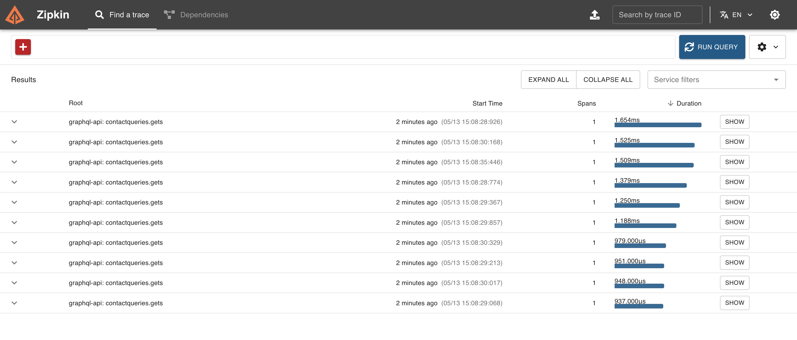
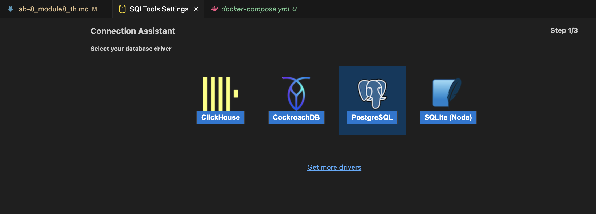
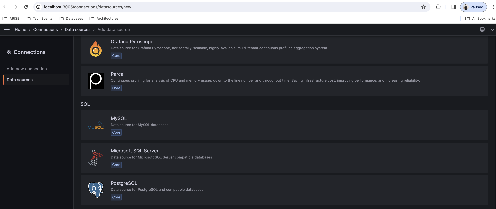
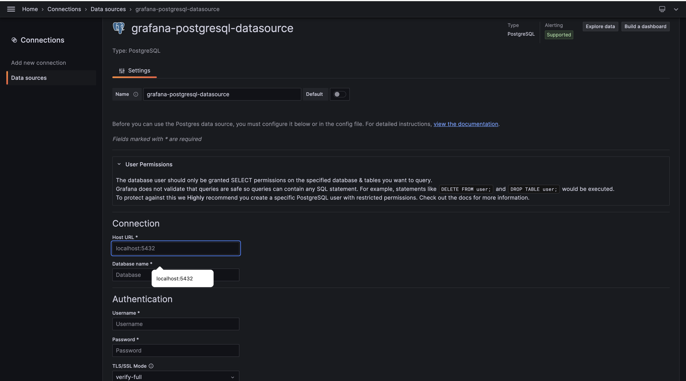
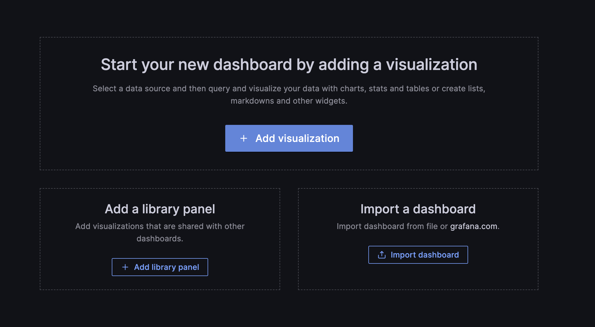

# Module 8: Performance and Monitoring
## Lab8.1 - Cache
**Objective:** Understand the purpose of using Cache and apply it.
**Related files in this Lab**
```plantuml
@startmindmap
* data
** event.db
* src
** graphql-api
*** cmd
**** server
***** main.go
*** config
**** config.go
*** internal
**** cache
***** cache-resolver.go
***** cache.go
***** redis.go
***** sqlite.go
*** pkg
**** graphql
***** resolvers
****** contact.resolver.go
***** types.go
@endmindmap

```
**Step**
1. Install Redis in Docker
```bash
docker run -p 6379:6379 --name redis -d redis

```

2. Create a Redis object in the *internale/cache/cache.go* folder. Enter the code:

```go
package cache

import (
	"context"
	"fmt"
	"time"
	"sync"
	"log"

	"github.com/go-redis/redis/v8"
	"github.com/spf13/viper"
)

var (
	redisOnce     sync.Once
	redisInstance *RedisClient
)
// RedisClient represents a simple Redis client.
type RedisClient struct {
	client *redis.Client
}

// NewRedisClient creates a new Redis client.
func NewRedisClient() (*RedisClient, error) {

	addr:= viper.GetString("CACHE_CON_STR")
	password:= viper.GetString("CACHE_PASSWORD")
	db:= viper.GetInt("CACHE_INDEX")
	
	// Create a new Redis client
	client := redis.NewClient(&redis.Options{
		Addr:     addr,
		Password: password,
		DB:       db,
	})

	// Ping the Redis server to check the connection
	ctx, cancel := context.WithTimeout(context.Background(), 5*time.Second)
	defer cancel()

	if _, err := client.Ping(ctx).Result(); err != nil {
		return nil, fmt.Errorf("failed to connect to Redis: %v", err)
	}

	return &RedisClient{client: client}, nil
}

// GetInstance returns the singleton instance of the Redis client.
func  GetRedisInstance() (*RedisClient, error) {
	redisOnce.Do(func() {
		var err error
		redisInstance, err = NewRedisClient()
		if err != nil {
			log.Fatalf("Error creating Redis client: %v", err)
		}
	})
	return redisInstance, nil
}

// Close closes the Redis connection.
func (rc *RedisClient) Close() error {
	return rc.client.Close()
}

// Get retrieves the value associated with the given key from Redis.
func (rc *RedisClient) Get(key string) (string, error) {
	ctx := context.Background()
	val, err := rc.client.Get(ctx, key).Result()
	if err == redis.Nil {
		return "", fmt.Errorf("key '%s' not found", key)
	} else if err != nil {
		return "", fmt.Errorf("failed to get value for key '%s': %v", key, err)
	}
	return val, nil
}

// Set sets the value associated with the given key in Redis.
func (rc *RedisClient) Set(key, value string) error {
	ctx := context.Background()
	cacheAge:= viper.GetInt("CACHE_AGE")
	err := rc.client.Set(ctx, key, value, time.Duration(cacheAge) *time.Second).Err()
	if err != nil {
		return fmt.Errorf("failed to set value for key '%s': %v", key, err)
	}
	return nil
}

// Remove removes the specified key from Redis.
func (rc *RedisClient) Remove(key string) error {
	ctx := context.Background()
	deleted, err := rc.client.Del(ctx, key).Result()
	if err != nil {
		return fmt.Errorf("failed to remove key '%s' from Redis: %v", key, err)
	}
	if deleted == 0 {
		return fmt.Errorf("key '%s' does not exist in Redis", key)
	}
	return nil
}

// Remove removes the specified key from Redis.
func (rc *RedisClient) Removes(key string) {
	ctx := context.Background()
	 // Use Lua script to delete keys by pattern
	 script := `
	 local keys = redis.call('KEYS', ARGV[1])
	 for i=1,#keys do
		 redis.call('DEL', keys[i])
	 end
	 return keys
 `
	// Execute Lua script
	result, err := rc.client.Eval(ctx, script, []string{}, key +"*").Result()
	if err != nil {
		panic(err)
	}

	// Print deleted keys
	deletedKeys, _ := result.([]interface{})
	log.Printf("deletedKeys%v", deletedKeys...)
	for _, key := range deletedKeys {
		// deleted, err := 
		rc.client.Del(ctx, key.(string)) //.Result() 
	}
}
```

3. Create a Sqlite Object for Caching with SQLite at *internal/cached/sqlite.go* Enter the code as follows.

```go
package cache

import (
	"database/sql"
	"fmt"
	"log"
	"sync"

	_ "github.com/mattn/go-sqlite3"
)

var (
	sqliteOnce     sync.Once
	sqliteInstance *SQLiteInMemClient
)

// SQLiteClient represents a simple SQLite client.
type SQLiteInMemClient struct {
	db *sql.DB
}

// NewSQLiteClient creates a new SQLite client with an in-memory database.
func NewSQLiteInMemClient() (*SQLiteInMemClient, error) {
	db, err := sql.Open("sqlite3", ":memory:")
	if err != nil {
		return nil, fmt.Errorf("failed to open SQLite database: %v", err)
	}
	if err := db.Ping(); err != nil {
		return nil, fmt.Errorf("failed to ping SQLite database: %v", err)
	}
	return &SQLiteInMemClient{db: db}, nil
}

// GetInstance returns the singleton instance of the SQLite client.
func GetSqliteInMemInstance() (*SQLiteInMemClient, error) {
	sqliteOnce.Do(func() {
		var err error
		sqliteInstance, err = NewSQLiteInMemClient()
		if err != nil {
			log.Fatalf("Error creating SQLite client: %v", err)
		}
	})
	return sqliteInstance, nil
}

// Close closes the SQLite database connection.
func (sc *SQLiteInMemClient) Close() error {
	return sc.db.Close()
}

// CreateTable creates a table in the SQLite database.
func (sc *SQLiteInMemClient) CreateTable() error {
	_, err := sc.db.Exec(`CREATE TABLE IF NOT EXISTS cache (
		key TEXT PRIMARY KEY,
		value TEXT
	)`)
	if err != nil {
		return fmt.Errorf("failed to create table in SQLite database: %v", err)
	}
	return nil
}

// Get retrieves the value associated with the given key from the SQLite database.
func (sc *SQLiteInMemClient) Get(key string) (string, error) {
	var value string
	err := sc.db.QueryRow("SELECT value FROM cache WHERE key = ?", key).Scan(&value)
	if err != nil {
		if err == sql.ErrNoRows {
			return "", fmt.Errorf("key '%s' not found", key)
		}
		return "", fmt.Errorf("failed to get value for key '%s': %v", key, err)
	}
	return value, nil
}

// Set sets the value associated with the given key in the SQLite database.
func (sc *SQLiteInMemClient) Set(key, value string) error {
	_, err := sc.db.Exec("INSERT INTO cache(key, value) VALUES(?, ?)", key, value)
	if err != nil {
		return fmt.Errorf("failed to set value for key '%s': %v", key, err)
	}
	return nil
}

// Remove removes the specified key from the SQLite database.
func (sc *SQLiteInMemClient) Remove(key string) error {
	res, err := sc.db.Exec("DELETE FROM cache WHERE key = ?", key)
	if err != nil {
		return fmt.Errorf("failed to remove key '%s' from SQLite database: %v", key, err)
	}
	count, err := res.RowsAffected()
	if err != nil {
		return fmt.Errorf("failed to check affected rows after removing key '%s': %v", key, err)
	}
	if count == 0 {
		return fmt.Errorf("key '%s' does not exist in SQLite database", key)
	}
	return nil
}

// Remove removes the specified key from the SQLite database.
func (sc *SQLiteInMemClient) Removes(key string)  {
	sc.db.Exec("DELETE FROM cache WHERE key Like ?", "%"+key+"*%")
}

```

4. Create a Cache Interface for supporting Cache selection between Redis or Sqlite at the file *internal/cache/cache.go*  enter the code as follows.

```go
package cache

import (
	"log"
)

// CacheBackend represents the backend for the cache.
type CacheBackend int

const (
	RedisBackend CacheBackend = iota
	SQLiteBackend
)

func IntToCacheBackend(i int) CacheBackend {
	switch i {
	case 0:
		return RedisBackend
	case 1:
		return SQLiteBackend
	default:
		return RedisBackend // or return an error, depending on your use case
	}
}

// Cache represents a cache with support for different backends.
type Cache struct {
	backend CacheBackend
	db      CacheDB
}

// CacheDB represents the interface for interacting with the cache database.
type CacheDB interface {
	Get(key string) (string, error)
	Set(key, value string) error
	Remove(key string) error
	Removes(key string)
	Close() error
}

// NewCache creates a new cache with the specified backend.
func NewCache(backend CacheBackend) *Cache {
	var db CacheDB
	switch backend {
	case RedisBackend:
		db,err := GetRedisInstance()
		if (err !=nil) {
			panic(err)
		}
		return &Cache{backend: backend, db: db}
	case SQLiteBackend:
		// db = &SQLiteInMemClient{}
		db,err := GetSqliteInMemInstance()
		if (err !=nil) {
			panic(err)
		}
		return &Cache{backend: backend, db: db}
	default:
		log.Fatalf("Unsupported cache backend: %v", backend)
	}
	return &Cache{backend: backend, db: db}
}

// Get retrieves the value associated with the given key from the cache.
func (c *Cache) Get(key string) (string, error) {
	return c.db.Get(key)
}

// Set sets the value associated with the given key in the cache.
func (c *Cache) Set(key, value string) error {
	return c.db.Set(key, value)
}

// Remove removes the specified key from the cache.
func (c *Cache) Remove(key string) error {
	return c.db.Remove(key)
}

// Remove removes the specified key from the cache.
func (c *Cache) Removes(key string) {
	c.db.Removes(key)
}
```

5. Add Configuration values ​​about Cache to the .env file.
```bash
CACHE_PROVIDER=0 #Redis
CACHE_CON_STR=127.0.0.1:6379
CACHE_PASSWORD=
CACHE_INDEX=0
CACHE_AGE=300
```
6. Create a Cache Resovlver to put in Resolver at the file *internale/cache/cache-resolver.go*. Enter the code as follows.

```go
package cache

import (
	"encoding/json"
	"fmt"
	// "graphql-api/internal/auth"
	"strings"
	"log"
	"github.com/graphql-go/graphql"
	"github.com/spf13/viper"
)

var cacheDB *Cache

func init() {
	cacheDB = NewCache(IntToCacheBackend(viper.GetInt("CACHE_PROVIDER")))
}

// Middleware to enforce authorization based on permission
func GetCacheResolver(next func(p graphql.ResolveParams) (interface{}, error)) func(p graphql.ResolveParams) (interface{}, error) {
	return func(p graphql.ResolveParams) (interface{}, error) {

		args := concatMapToString(p.Args)
		hashKey := p.Info.ParentType.Name() + "." + p.Info.FieldName + "_" + args // auth.HashString(args)
		log.Printf("\nRead cached Key:[%s] to get data\n", hashKey)
		// if exist cached
		jsonData, err := cacheDB.Get(hashKey)
		// fmt.Printf("Cache Data:%s | error:%v \n", jsonData, err)

		if err == nil {
			// Convert the JSON strings to the appropriate data structures
			arrayData, err := convertToSliceOfMaps(jsonData)
			if err == nil {
				log.Println("[Success] Get Data from cached")
				return arrayData, nil
			}
			objectData, err := convertToMap(jsonData)
			if err == nil {
				log.Println("[Success] Get Data from cached")
				return objectData, nil
			}
		}

		// Execute the resolver if permission is granted
		return next(p)
	}
}

// Middleware to enforce authorization based on permission
func SetCacheResolver(p graphql.ResolveParams, data interface{}) {
	args := concatMapToString(p.Args)
	hashKey := p.Info.ParentType.Name() + "." + p.Info.FieldName + "_" + args // auth.HashString(args)
	log.Printf("\nRead cached Key:[%s] to set data", hashKey)
	jsonData, err := json.Marshal(data)
	if err == nil {
		cacheDB.Set(hashKey, string(jsonData))
		log.Printf("\nSet Data to cached [%s]", hashKey)
	}
}

func RemoveGetCacheResolver(key string) {
	cacheDB.Removes(key) 
}

func concatMapToString(m map[string]interface{}) string {
	var result strings.Builder

	// Iterate over the map and concatenate values
	for _, value := range m {
		strValue := fmt.Sprintf("%v", value)
		result.WriteString(strValue)
	}

	return result.String()
}

// Function to convert a JSON string to []map[string]interface{} if it represents an array
func convertToSliceOfMaps(jsonStr string) ([]map[string]interface{}, error) {
	var data []map[string]interface{}
	err := json.Unmarshal([]byte(jsonStr), &data)
	return data, err
}

// Function to convert a JSON string to map[string]interface{} if it represents an object
func convertToMap(jsonStr string) (map[string]interface{}, error) {
	var data map[string]interface{}
	err := json.Unmarshal([]byte(jsonStr), &data)
	return data, err
}

```

7. Implement the *GetCacheResolver* function. put it in the function *ContactQueriesType* in various Gets sections.

```go
// pkg/graphql/types.go
import (
    ...
	"graphql-api/internal/cache"
)
var ContactQueriesType = graphql.NewObject(graphql.ObjectConfig{
	Name: "ContactQueries",
	Fields: graphql.Fields{
		"gets": &graphql.Field{
			Type:    graphql.NewList(ContactGraphQLType),
			Args:    SearhTextQueryArgument,
            // Add cache.GetCacheResolver
			Resolve: auth.AuthorizeResolverClean("contacts.gets", cache.GetCacheResolver(resolvers.GetContactResolve)),
		},
		"getPagination": &graphql.Field{
			Type:    ContactPaginationGraphQLType,
			Args:    SearhTextPaginationQueryArgument,
			 // Add cache.GetCacheResolver
            Resolve: auth.AuthorizeResolverClean("contacts.getPagination", cache.GetCacheResolver(resolvers.GetContactsPaginationResolve)),
		},
		"getById": &graphql.Field{
			Type:    ContactGraphQLType,
			Args:    IdArgument,
			 // Add cache.GetCacheResolver
            Resolve: auth.AuthorizeResolverClean("contacts.getById", cache.GetCacheResolver(resolvers.GetContactByIdResolve)),
		},
	},
})
```

8. Put the *SetCacheResolver* function in *pkg/graphql/resolvers/contact.resolver.go* or the desired resolver get in the various Gets section after successful processing.

```go
func GetContactResolve(params graphql.ResolveParams) (interface{}, error) {
	// Update limit and offset if provided
	limit, ok := params.Args["limit"].(int)
	if !ok {
		limit = 10
	}

	offset, ok := params.Args["offset"].(int)
	if !ok {
		offset = 0
	}

	searchText, ok := params.Args["searchText"].(string)
	if !ok {
		searchText = ""
	}
	contactRepo := contact.NewContactRepo()

	// Fetch contacts from the database
	contacts, err := contactRepo.GetContactsBySearchText(searchText, limit, offset)
	if err != nil {
		return nil, err
	}
	// time.Sleep(1 * time.Minute)
    // Set Cached
	go cache.SetCacheResolver(params, contacts)
	
	return contacts, nil
}

func GetContactsPaginationResolve(params graphql.ResolveParams) (interface{}, error) {
	// Update limit and offset if provided
	page, ok := params.Args["page"].(int)
	if !ok {
		page = 1
	}

	pageSize, ok := params.Args["pageSize"].(int)
	if !ok {
		pageSize = 10
	}

	searchText, ok := params.Args["searchText"].(string)
	if !ok {
		searchText = ""
	}
	contactRepo := contact.NewContactRepo()

	// Fetch contacts from the database
	contacts, pager, err := contactRepo.GetContactsBySearchTextPagination(searchText, page, pageSize)
	var contactPagination = models.ContactPaginationModel{
		Contacts:   contacts,
		Pagination: pager,
	}

	if err != nil {
		return nil, err
	}

    // Set Cache
	go cache.SetCacheResolver(params, contacts)

	return contactPagination, nil
}

func GetContactByIdResolve(params graphql.ResolveParams) (interface{}, error) {
	id := params.Args["id"].(int)
	contactRepo := contact.NewContactRepo()

	// Fetch contacts from the database
	contact, err := contactRepo.GetContactByID(id)
	if err != nil {
		return nil, err
	}
    // Set Cache
	go cache.SetCacheResolver(params, contact)
	return contact, nil
}
```

9. Put the *RemoveGetCacheResolver* function in *CretateContactResolve*. When new information is created This ensures that users receive updated information when data is retrieved.

```go
func CretateContactResolve(params graphql.ResolveParams) (interface{}, error) {
	// Map input fields to Contact struct
	input := params.Args["input"].(map[string]interface{})
	invalids := validateContact(input)

	if len(invalids) > 0 {
		return nil, fmt.Errorf("%v", invalids)
	}

	contactInput := models.ContactModel{

		Name:      input["name"].(string),
		FirstName: input["first_name"].(string),
		LastName:  input["last_name"].(string),
		GenderId:  input["gender_id"].(int),
		Dob:       input["dob"].(time.Time),
		Email:     input["email"].(string),
		Phone:     input["phone"].(string),
		Address:   input["address"].(string),
		PhotoPath: input["photo_path"].(string),
		CreatedBy: "test-api",
		CreatedAt: time.Now(),
	}

	contactRepo := contact.NewContactRepo()

	// Insert Contact to the database
	id, err := contactRepo.InsertContact(&contactInput)
	if err != nil {
		return nil, err
	}
	contactInput.ContactId = int64(id)
    // Clear Cache to make sure that user will got updated data.
	go cache.RemoveGetCacheResolver("ContactQueries")
	return contactInput, nil
}
```

10. Test Query and Mutation

```graphql
{
  contacts {
    gets(searchText: "") {
      name
      first_name
      last_name
      gender_id
      dob
      email
      phone
      address
      photo_path
      created_at
      created_by
    }
    getById(id: 1) {
      name
      first_name
      last_name
      gender_id
      dob
      email
      phone
      address
      photo_path
      created_at
      created_by
    }
  }
}

```

## Lab8.2 - Open Telemetry
**Objective:** Understand the purpose of using Open Telemetry for Trace Monitoring.
**Related files in this lab**
```plantuml
@startmindmap
* data
** event.db
* src
** graphql-api
*** cmd
**** server
***** main.go
*** config
**** config.go
*** internal
**** monitoring
***** otel.go
***** otel.resolver.go
*** pkg
**** graphql
***** resolvers
****** contact.resolver.go
***** types.go
@endmindmap

```

1. Install the Open Telemetry library and exporters zipkin.

```bash
go get go.opentelemetry.io/otel
go get go.opentelemetry.io/otel/exporters/zipkin
go get go.opentelemetry.io/otel/sdk/trace
go get go.opentelemetry.io/otel/semconv/v1.24.0
```
2. Install zipkin as a UI for viewing Monitor Trace results.

```bash
docker run -d -p 9411:9411 openzipkin/zipkin
```
3. Write the go code at internal/monitoring/otel.go. Enter the code as follows.

```go
package monitoring

import (
	"log"
	"context"
	"os"

	"go.opentelemetry.io/otel"
	"go.opentelemetry.io/otel/exporters/zipkin"
	"go.opentelemetry.io/otel/sdk/resource"
	sdktrace "go.opentelemetry.io/otel/sdk/trace"
	semconv "go.opentelemetry.io/otel/semconv/v1.24.0"
)


var logger = log.New(os.Stderr, "graphql-api", log.Ldate|log.Ltime|log.Llongfile)

// initTracer creates a new trace provider instance and registers it as global trace provider.
func InitTracer(url string) (func(context.Context) error, error) {
	// Create Zipkin Exporter and install it as a global tracer.
	//
	// For demoing purposes, always sample. In a production application, you should
	// configure the sampler to a trace.ParentBased(trace.TraceIDRatioBased) set at the desired
	// ratio.
	exporter, err := zipkin.New(
		url,
		zipkin.WithLogger(logger),
	)
	if err != nil {
		return nil, err
	}

	batcher := sdktrace.NewBatchSpanProcessor(exporter)

	tp := sdktrace.NewTracerProvider(
		sdktrace.WithSpanProcessor(batcher),
		sdktrace.WithResource(resource.NewWithAttributes(
			semconv.SchemaURL,
			semconv.ServiceName("graphql-api"),
		)),
	)
	otel.SetTracerProvider(tp)

	return tp.Shutdown, nil
}

```

4. Create an otel resolver at internal/monitoring/otel.resolver.go. Enter the code:

```go
package monitoring

import (
	"github.com/graphql-go/graphql"
	"go.opentelemetry.io/otel"
)

// Middleware to trace resolver functions
func TraceResolver(resolverFunc func(p graphql.ResolveParams) (interface{}, error)) graphql.FieldResolveFn {
	return func(p graphql.ResolveParams) (interface{}, error) {
		// Create a new span for the resolver function
		spanName := p.Info.ParentType.Name() + "." + p.Info.FieldName
		ctx, span := otel.GetTracerProvider().Tracer("").Start(p.Context, spanName)
		defer span.End()

		// Perform the resolver logic
		return resolverFunc(graphql.ResolveParams{Source: p.Source, Args: p.Args, Info: p.Info, Context: ctx})
	}
}

```
5. Add Configuration for referring to Trace Server in .env as follows.
```bash
TRACE_EXPORTER_URL=http://localhost:9411/api/v2/spans
```
6. Apply otel in the file *cmd/server/main.go* import package monitoring in main.go and call the InitTracer function as follows.

```go
import
    (
        ...
        "graphql-api/internal/monitoring")

    
    func main() {
	
	shutdown, err :=  monitoring.InitTracer(viper.GetString("TRACE_EXPORTER_URL"))
	ctx, cancel := signal.NotifyContext(context.Background(), os.Interrupt)
	defer cancel()

	if err != nil {
		log.Fatal(err)
	}
	defer func() {
		if err := shutdown(ctx); err != nil {
			log.Fatal("failed to shutdown TracerProvider: %w", err)
		}
	}()
    ...
```

5. Put otel resolver in the resolver that needs to be monitored.
```go
// pkg/graphql/types.go
// Define the ContactQueries type
var ContactQueriesType = graphql.NewObject(graphql.ObjectConfig{
	Name: "ContactQueries",
	Fields: graphql.Fields{
		"gets": &graphql.Field{
			Type:    graphql.NewList(ContactGraphQLType),
			Args:    SearhTextQueryArgument,
			Resolve: auth.AuthorizeResolverClean("contacts.gets",
            // add monitor Trace Resolver
            monitoring.TraceResolver( cache.GetCacheResolver(resolvers.GetContactResolve))),
		},
		"getPagination": &graphql.Field{
			Type:    ContactPaginationGraphQLType,
			Args:    SearhTextPaginationQueryArgument,
			Resolve: auth.AuthorizeResolverClean("contacts.getPagination", cache.GetCacheResolver(resolvers.GetContactsPaginationResolve)),
		},
		"getById": &graphql.Field{
			Type:    ContactGraphQLType,
			Args:    IdArgument,
			Resolve: auth.AuthorizeResolverClean("contacts.getById", cache.GetCacheResolver(resolvers.GetContactByIdResolve)),
		},
	},
})
```
6. test graphql query
```graphql
{
  contacts {
    gets(searchText: "") {
      name
      first_name
      last_name
      gender_id
      dob
      email
      phone
      address
      photo_path
      created_at
      created_by
    }
  }
}
```
7. Open zipkin to view the monitor at http://localhost:9411


*Figure 8.1 Zipkin Trace Monitor.*

## Lab8.3 - Metric Monitoring
**Objective:** Understand the purpose of using Metrics and apply them.
**ไฟล์ทีี่เกี่ยวข้องใน Lab นี้**
```plantuml
@startmindmap
* data
** event.db
* src
** graphql-api
*** cmd
**** server
***** main.go
*** config
**** .env
*** internal
**** logger
***** logger.go
***** postgres-logger.go
*** pkg
**** data
***** postgresdb.go
**** maintenance
***** main.go
@endmindmap

```
1. Prepare the docker-compose file in the root folder of the project at */graphql-tutorial/infra/metric-server/docker-compose.yml* with the following code.
```go
version: '3.8'

services:
  timescaledb:
    image: timescale/timescaledb:latest-pg13
    environment:
      - POSTGRES_PASSWORD=P@ssw0rd
      - POSTGRES_USER=admin
      - POSTGRES_DB=metricdb
    ports:
      - "5432:5432"
    volumes:
      - ./timescaledb_data:/var/lib/postgresql/data

  grafana:
    image: grafana/grafana:latest
    environment:
      - GF_SECURITY_ADMIN_PASSWORD=P@ssw0rd
    ports:
      - "3005:3000"
    depends_on:
      - timescaledb

volumes:
  timescaledb_data:
```
2. Prepare the code for connecting to the Postgres database at *pkg/data/postgresdb.go* with the code as follows.

```go
package data

import (
	"database/sql"
	"fmt"
	"log"
	"sync"

	"graphql-api/config"

	_ "github.com/lib/pq"
	"github.com/spf13/viper"
)

// DB represents the PostgreSQL database
type PostgresDB struct {
	Connection *sql.DB
}

var postgresInstance *PostgresDB
var postgresOnce sync.Once

// NewDB initializes a new instance of the DB struct
func NewPostgresDB() *PostgresDB {
	postgresOnce.Do(func() {
		config := config.NewConfig()
		connStr := fmt.Sprintf("host=%s port=%d user=%s password=%s dbname=%s sslmode=disable",
			config.DBHost, config.DBPort, config.DBUser, config.DBPassword, viper.GetString("METRIC_DB"))
		conn, err := sql.Open("postgres", connStr)
		if err != nil {
			log.Fatal(err)
		}
		postgresInstance = &PostgresDB{conn}
	})
	return postgresInstance
}

// Close closes the database connection
func (db *PostgresDB) Close() error {
	if db.Connection == nil {
		return nil
	}
	return db.Connection.Close()
}

// Insert inserts data into the specified table
func (db *PostgresDB) Insert(query string, args ...interface{}) (sql.Result, error) {
	stmt, err := db.Connection.Prepare(query)
	if err != nil {
		return nil, fmt.Errorf("failed to prepare statement: %v", err)
	}
	defer stmt.Close()

	result, err := stmt.Exec(args...)
	if err != nil {
		return nil, fmt.Errorf("failed to execute statement: %v", err)
	}

	return result, nil
}

// Query executes a query and returns rows
func (db *PostgresDB) Query(query string, args ...interface{}) (*sql.Rows, error) {
	rows, err := db.Connection.Query(query, args...)
	if err != nil {
		return nil, fmt.Errorf("failed to execute query: %v", err)
	}

	return rows, nil
}

// QueryRow executes a query that is expected to return at most one row
func (db *PostgresDB) QueryRow(query string, args ...interface{}) *sql.Row {
	row := db.Connection.QueryRow(query, args...)
	return row
}

// Delete executes a delete statement
func (db *PostgresDB) Delete(query string, args ...interface{}) (sql.Result, error) {
	stmt, err := db.Connection.Prepare(query)
	if err != nil {
		return nil, fmt.Errorf("failed to prepare statement: %v", err)
	}
	defer stmt.Close()

	result, err := stmt.Exec(args...)
	if err != nil {
		return nil, fmt.Errorf("failed to execute statement: %v", err)
	}

	return result, nil
}

// Update executes an update statement
func (db *PostgresDB) Update(query string, args ...interface{}) (sql.Result, error) {
	stmt, err := db.Connection.Prepare(query)
	if err != nil {
		return nil, fmt.Errorf("failed to prepare statement: %v", err)
	}
	defer stmt.Close()

	result, err := stmt.Exec(args...)
	if err != nil {
		return nil, fmt.Errorf("failed to execute statement: %v", err)
	}

	return result, nil
}

func (db *PostgresDB) Begin() (*sql.Tx, error) {
	tx, err := db.Connection.Begin()
	if err != nil {
		return nil, fmt.Errorf("failed to begin transaction: %v", err)
	}
	return tx, nil
}

func (db *PostgresDB) Prepare(query string) (*sql.Stmt, error) {
	stmt, err := db.Connection.Prepare(query)
	if err != nil {
		return nil, fmt.Errorf("failed to prepare statement: %v", err)
	}
	return stmt, nil
}

func (db *PostgresDB) Exec(query string, args ...interface{}) (sql.Result, error) {
	result, err := db.Connection.Exec(query, args...)
	if err != nil {
		return nil, fmt.Errorf("failed to execute statement: %v", err)
	}
	return result, nil
}
```

3. Add a function for writing data to the log table to the Postgres database at internal/postgres-logger.go with the following code.

```go
package logger

import (
	"fmt"
	"graphql-api/pkg/data"
	"graphql-api/pkg/data/models"
)

// Logger represents the repository for logging operations
type PostgresLogger struct {
	DB *data.PostgresDB
}

// NewLogger creates a new instance of Logger
func NewPostgresLogger() *PostgresLogger {
	db := data.NewPostgresDB()
	return &PostgresLogger{DB: db}
}

// InsertLog inserts multiple LogModel entries into the database
func (logger *PostgresLogger) InsertLog(logEntries []models.LogModel) error {
	// Prepare the SQL insert statement
	query := `
    INSERT INTO logs (
        log_id,
        timestamp,
        user_id,
        action,
        resource,
        status,
        client_ip,
        client_device,
        client_os,
        client_os_ver,
        client_browser,
        client_browser_ver,
        duration,
        errors
    ) VALUES ($1, $2, $3, $4, $5, $6, $7, $8, $9, $10, $11, $12, $13, $14)
    `

	// Prepare the SQL statement
	stmt, err := logger.DB.Prepare(query)
	if err != nil {
		return fmt.Errorf("error preparing insert statement: %w", err)
	}
	defer stmt.Close()

	// Iterate through the log entries and insert each one
	for _, logEntry := range logEntries {
		_, err := stmt.Exec(
			logEntry.LogId,
			logEntry.Timestamp,
			logEntry.UserId,
			logEntry.Actions,
			logEntry.Resource,
			logEntry.Status,
			logEntry.ClientIp,
			logEntry.ClientDevice,
			logEntry.ClientOs,
			logEntry.ClientOsVersion,
			logEntry.ClientBrowser,
			logEntry.ClientBrowserVersion,
			logEntry.Duration.Nanoseconds(),
			logEntry.Errors,
		)

		if err != nil {
			return fmt.Errorf("error inserting log: %w", err)
		}
	}

	return nil
}

```

4. Add a function to read log files and write them to the Postgres database at *internal/logger/logger.go*. Add code as follows.

```go
// Function to read the last log file and insert its content into SQLite
func (li *Logger) MoveLogsToPostgres() {

	absolutePath, err := filepath.Abs(relativePath)
	if err != nil {
		log.Printf("Error reading logs directory: %v", err)
		return
	}

	// Get and sort the files by the oldest modification time
	files, err := listFilesOrderedByOldest(absolutePath)
	if err != nil {
		log.Fatalf("Error reading directory: %v", err)
	}

	if len(files) == 0 {
		return // No logs to process
	}

	// Read the log file and insert into SQLite
	logFilePath := filepath.Join(absolutePath, files[0].Name)
	file, err := os.Open(logFilePath)
	if err != nil {
		log.Printf("Error opening log file: %v", err)
		return
	}

	defer file.Close()
	scanner := bufio.NewScanner(file)
	var logList []models.LogModel
	for scanner.Scan() {
		var logEntry models.LogModel
		if err := json.Unmarshal([]byte(scanner.Text()), &logEntry); err != nil {
			log.Printf("Error unmarshaling log data: %v", err)
			continue
		}

		log.Printf("Error inserting into SQLite: %v", logEntry)
		logList = append(logList, logEntry)
		// fmt.Printf("%v", logList)
	}

	logger := NewPostgresLogger()
	logger.InsertLog(logList)

	// Delete the log file after processing
	err = os.Remove(logFilePath)
	if err != nil {
		log.Printf("Error deleting log file: %v", err)
	}

}
```

5. Change the function in Background Process in *pkg/maintenance/main.go* that is responsible for writing logs to the database. Change from Sqlite to use Postgres as follows.
```go
package main

import (
	"os"
	"time"

	"graphql-api/config"
	"graphql-api/internal/logger"
	"log"
)

func main() {
	// Load configuration
	config := config.NewConfig()
	go moveAuditLog(config)
	// Keep the main goroutine alive
	select {}
}

func moveAuditLog(cfg *config.Config) {
	auditLog := logger.GetLogInitializer()
	logger := log.New(os.Stdout, "", log.LstdFlags|log.Lmicroseconds)
	for {
		logger.Println("[info] - Run Move Audit Log")
		// เปลี่ยนตรงนี้
		auditLog.MoveLogsToPostgres()
		logger.Println("[info] - End Move Audit Log")
		time.Sleep(time.Duration(cfg.LogMoveMin) * time.Minute)
	}
}
```

6. Prepare the Server for Postgres TimescaleDB and Grafana for Metric Monitoring. Open the terminal command line, go to infra/metric-server, type

```go
docker-compose up
```

ึ7. Install SQLTools Postgres in VSCode to connect to the Timescaledb database.


*Figure 8.2 Postgres Extension.*

8. Setup values ​​to connect to Postgres according to the values ​​in Docker Compose.


*Figure 8.3 Postgres Setup.*

9. Create a database named logs, enter sql as follows.
```sql

CREATE TABLE IF NOT EXISTS logs (
    log_id varchar(50),
    timestamp TIMESTAMPTZ NOT NULL,
    user_id INTEGER,
    action varchar(100),
    resource varchar(50),
    status varchar(50),
    client_ip varchar(50),
    client_device varchar(50),
    client_os varchar(50),
    client_os_ver varchar(50),
    client_browser varchar(50),
    client_browser_ver varchar(50),
    duration INTERVAL, -- Using INTERVAL to store duration
    errors varchar(50),
    created_at TIMESTAMPTZ DEFAULT CURRENT_TIMESTAMP
);

-- Create a time-series hypertable partitioned by timestamp
SELECT create_hypertable('logs', 'timestamp');

```
10. Create a View for summarizing success and errors from the log.
```sql

CREATE OR REPLACE VIEW vw_log_status_summary
AS 
SELECT
timestamp,
    action,
    CASE WHEN status = 'OK' and errors = '' THEN 1 ELSE  0 END AS success,
    CASE WHEN errors IS NOT NULL AND errors != '' THEN 1 ELSE 0 END error
FROM
    logs
```
11. Test graphql Query to create logs
12. Run *maintenance/main.go* To test writing logs to postres
13. Open your browser and go to localhost:3005. to access Grafana
14. Add Data Source Postgres to Grafana


*Figure 8.4 Add Datasource at Grafana.*


*Figure 8.5 Add Postgres at Grafana.*

 
*Figure 8.6 Postgres Setting.*

Look at the ip in docker.

```bash
docker exec -it ed2982693173 bash
```
```bash
ed2982693173:/# ifconfig
eth0      Link encap:Ethernet  HWaddr 02:42:AC:16:00:02
		 # Look at this line of ip.
          inet addr:172.22.0.2  Bcast:172.22.255.255  Mask:255.255.0.0
          UP BROADCAST RUNNING MULTICAST  MTU:1500  Metric:1
          RX packets:3714 errors:0 dropped:0 overruns:0 frame:0
          TX packets:2862 errors:0 dropped:0 overruns:0 carrier:0
          collisions:0 txqueuelen:0 
          RX bytes:543180 (530.4 KiB)  TX bytes:1188205 (1.1 MiB)

lo        Link encap:Local Loopback  
          inet addr:127.0.0.1  Mask:255.0.0.0
          UP LOOPBACK RUNNING  MTU:65536  Metric:1
          RX packets:28708 errors:0 dropped:0 overruns:0 frame:0
          TX packets:28708 errors:0 dropped:0 overruns:0 carrier:0
          collisions:0 txqueuelen:1000 
          RX bytes:10306281 (9.8 MiB)  TX bytes:10306281 (9.8 MiB)
```
15. Create a Dashboard named Api Status.

 
*Figure 8.7 Create Visulization.*

16. Enter Query and select refresh every 5 minutes and fire Graphql query continuously.